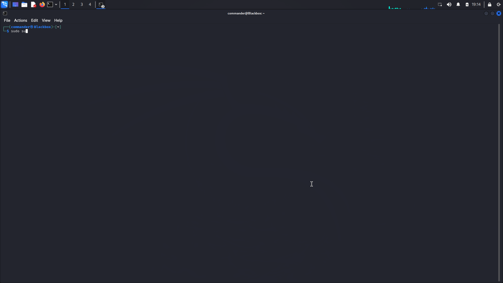
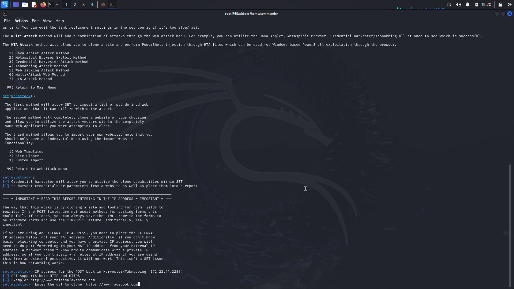
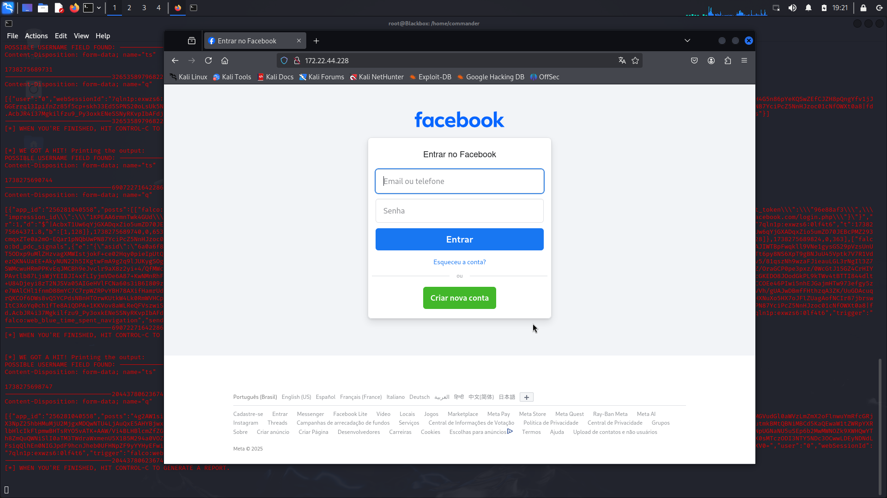

# Phishing para Captura de Senhas do Facebook

## Introdução

Este documento descreve um método de phishing para capturar senhas do Facebook utilizando ferramentas disponíveis no Kali Linux. É importante ressaltar que a prática de phishing é ilegal e antiética. Este guia é fornecido apenas para fins educacionais e de conscientização sobre segurança cibernética.

## Ferramentas Necessárias

- **Kali Linux**: Uma distribuição Linux voltada para testes de penetração e segurança.
- **SETOOLKIT (Social-Engineer Toolkit)**: Uma ferramenta que facilita a execução de ataques de engenharia social.

## Configurando o Phishing no Kali Linux

### Passo a Passo

1. **Acesso como Root**  
   Para garantir que você tenha as permissões necessárias, inicie uma sessão como root:
   ```sudo su```
    

2. **Iniciando o SET**
    Execute o Social-Engineer Toolkit:
    ```setoolkit```
     após a execução do comando 'setoolkit'.")

3. **Selecionando o Tipo de Ataque**
    Escolha a opção para ataques de engenharia social:
    ```1) Social-Engineering Attacks```
     Social-Engineering Attacks' destacada para seleção de ataques de engenharia social.")

4. **Selecionando o Vetor de Ataque**
    Escolha a opção para vetores de ataque de sites:
    ```2) Web Site Attack Vectors```
     Web Site Attack Vectors' selecionada para escolher vetores de ataque baseados em sites.")

5. **Selecionando o Método de Ataque**
    Escolha o método de captura de credenciais:
    ```3) Credential Harvester Attack Method```
     Credential Harvester Attack Method' para captura de credenciais.")

6. **Selecionando o Método de Clonagem de Site**
    Escolha a opção para clonar um site:
    ```2) Site Cloner```
     Site Cloner' destacada para clonar um site.")

7. **URL para Clonagem**
    Insira a URL do site que deseja clonar. Neste caso, use:
    ```https://www.facebook.com```
    

8. **Resultados**
    Após a configuração, você deverá ser capaz de capturar as credenciais inseridas na página clonada. Abaixo está um exemplo de captura de senhas:

    